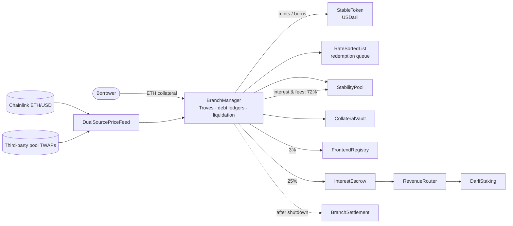

<div align="center">

# Darli

**An immutable, ETH-backed stablecoin protocol for Base.**

Borrowers set their own interest rate · a Stability Pool settles liquidations without market sales ·
a revenue-sharing token with no vote · a staged, order-free settlement after shutdown.

[](https://github.com/usdarli/darli/actions/workflows/ci.yml)
[](LICENSE)
[](CHANGELOG.md)
[](contracts/)
[](https://book.getfoundry.sh/)
[-3776AB.svg?logo=python&logoColor=white)](model/)

[Whitepaper](docs/WHITEPAPER.md) ·
[Specification](docs/SPEC.md) ·
[Results](docs/RESULTS.md) ·
[Threat model](docs/THREATS.md) ·
[Contributing](CONTRIBUTING.md) ·
[Security](SECURITY.md)

</div>

> [!WARNING]
> **Research pre-release 0.0.1** — a specification, a reference model and a partial Solidity implementation.
> **Nothing is deployed or audited.** This repository is not an offer of any token or financial product.

---

## Contents

- [Overview](#overview)
- [Key properties](#key-properties)
- [What this costs — read before the benefits](#what-this-costs--read-before-the-benefits)
- [How it fits together](#how-it-fits-together)
- [Repository layout](#repository-layout)
- [Getting started](#getting-started)
- [Reproducing the evidence](#reproducing-the-evidence)
- [Project status](#project-status)
- [Documentation](#documentation)
- [Contributing](#contributing)
- [Security](#security)
- [License](#license)

## Overview

Darli lets anyone borrow **USDarli**, a dollar stablecoin, against ETH. Every protocol rule exists in three places
that must agree with each other:

1. **[`docs/SPEC.md`](docs/SPEC.md)** — the normative rules, each carrying the identifier of the test that pins it.
2. **[`model/`](model/)** — an executable reference model in Python: standard library only, exact integer arithmetic.
3. **[`contracts/`](contracts/)** — the Solidity implementation (Foundry), replayed against the model wei for wei.

Because the protocol is **immutable**, a bug in a deployed contract can never be patched. The repository is built
around that fact: scenarios, invariant fuzzers with coverage floors, mutants the tests must kill, and differential
traces between the model and the contracts.

## Key properties

| | |
| --- | --- |
| **Borrower-set rates** | Borrow USDarli against ETH at an interest rate you choose; the lowest rates are redeemed first. |
| **No forced market sales** | Debt is settled by a Stability Pool, then by redistribution, then by an explicit bad-debt ledger. Liquidation never depends on selling collateral in a market. |
| **Two price sources** | An external ETH/USD feed, cross-checked against and backed by the liquidity-weighted median of third-party ETH/stablecoin pools, with sequencer and staleness guards and fixed gas stipends. The protocol's own pool is never a price source. |
| **Immutable** | No owner, proxy, pause, setter or vote. The debt cap raises itself on a schedule. New collateral means a new, independent deployment. |
| **DARLI: revenue, no power** | DARLI has no vote; stakers receive 25% of interest and loan fees in fixed weekly epochs. |
| **Order-free settlement** | After a shutdown, one reference price is fixed, every Trove is settled, and every USDarli then claims the same fraction of the pot, in any order. |

## What this costs — read before the benefits

- **A shutdown is not an instant withdrawal.** No holder is paid until every Trove has been processed; a Trove nobody
  processes can be written off only after 30 days.
- **A healthy borrower's surplus can cover other borrowers' losses.** At settlement, the surplus collateral of healthy
  Troves absorbs the shortfall of under-water Troves first, every healthy borrower giving up the same fraction; holders
  take a haircut only after that.
- **The pilot's liquidity and keepers are not funded by the protocol.** No share of revenue goes to liquidity
  providers; the market depth and the keepers that hold the peg in the simulations were assumed to be provided by the
  team.
- **Nothing can be patched.** A bug in a deployed contract is permanent; the only remedy is to leave and redeploy.

## How it fits together



The core's only external calls are the collateral token, the price feed and the stablecoin. Risk-reducing actions —
`repay`, `addColl`, `closeTrove`, Stability Pool withdrawal, `claimSurplus`, `settleTrove` — never depend on a price, an
administrative permission or a callback into user code.

## Repository layout

```text
darli/
├── docs/
│   ├── SPEC.md          # normative specification: decisions, constants, every rule with its test, open items
│   ├── WHITEPAPER.md    # the public whitepaper
│   ├── RESULTS.md       # results of record: hash manifest and generated figures
│   └── THREATS.md       # threat model
├── model/               # Python reference model, scenarios, fuzzers, mutants, agent-based simulator
├── contracts/           # Solidity (Foundry): src/, test/, fork/, script/, lib/ (submodules)
├── frontend/            # one self-contained HTML page for every user action, to be pinned on IPFS
├── Makefile             # every check CI and the release gate run
├── AGENTS.md            # operating rules for contributors and AI coding agents
├── RELEASING.md         # release checklist
├── CHANGELOG.md
├── CONTRIBUTING.md
└── SECURITY.md
```

| Path | Description |
| --- | --- |
| [`model/`](model/) | Executable reference model (Python, standard library only, exact integer arithmetic): scenarios, two fuzzers with asserted coverage floors, mutants the tests must kill, and an agent-based simulator. |
| [`contracts/`](contracts/) | Math libraries checked bit-for-bit against the model; the stablecoin; the two-source oracle; the one-shot deployer; the live branch (borrowing, redemption queue, Stability Pool, liquidation, redistribution, redemption routing); settlement after shutdown as a contract of its own; the revenue router and DARLI staking; and the liquidity vault on Uniswap v4. `script/DarliSystem.s.sol` builds a whole system at predicted addresses and checks it link by link before it is sealed. |
| [`contracts/fork/`](contracts/fork/) | Tests that need Base itself — the PoolManager's storage layout, the pool race, the vault on a real pool, the live price feed and the pools behind it — plus the path around a censoring sequencer on an Ethereum fork. |
| [`frontend/`](frontend/) | A single HTML page with no external script, style or font. Each action can also be sent through Ethereum. `contracts/script/check_frontend.py` checks its function selectors against the contracts. |

## Getting started

### Prerequisites

| Tool | Version | Needed for |
| --- | --- | --- |
| [Python](https://www.python.org/) | 3.12 (as in CI) | the reference model and all checks — no third-party packages |
| [Foundry](https://book.getfoundry.sh/getting-started/installation) | v1.5.1 (as in CI) | building and testing the contracts |
| `make`, `bash`, `curl` | any recent | the Makefile targets |

### Clone

```bash
git clone --recurse-submodules https://github.com/usdarli/darli.git
cd darli

# already cloned without submodules?
git submodule update --init --recursive
```

Submodules (in `contracts/lib/`): `forge-std`, `openzeppelin-contracts` and Uniswap `v4-core`.

### First run

```bash
make help     # list every target
make smoke    # the fast set — run it before you change anything
```

## Reproducing the evidence

All checks live in the [`Makefile`](Makefile); CI runs the same targets, so a green `make check` and a green CI mean
the same thing.

| Target | What it does |
| --- | --- |
| `make smoke` | Scenarios, simulator self-tests, both fuzzers at a short budget, `spec_check`, manifest and figures (a minute or two). |
| `make evidence` | Every producer at the configuration `docs/RESULTS.md` records, then the document checks (slow). |
| `make contracts` | `forge fmt --check`, the differential vectors and `forge test`. |
| `make check` | `smoke` + `evidence` + `contracts` — the whole release gate. |
| `make record` | Regenerate figures and manifest after a change; read the diff before committing. |
| `make fork` | The tests that need Base (and Ethereum) itself, against the first public endpoint that answers. |
| `make rehearse` | The deployment scripts and a user, in real transactions on a local fork of Base (anvil). |
| `make fmt` | Format the Solidity — read the `forge fmt` warning in [`AGENTS.md`](AGENTS.md) §7 first. |

Or run the pieces individually:

```bash
cd model
python3 test_scenarios.py          # the scenarios
python3 fuzz.py 30 300             # accounting fuzzer: invariants around every step, plus coverage floors
python3 fuzz_oracle.py 200 150     # oracle failure detection
python3 test_econ_sim.py           # simulator self-tests
python3 mutants.py M39             # one mutant at a time
python3 mutants.py                 # every mutant; exit code 1 on a survivor or an invalid mutant
python3 spec_check.py              # every scenario cited in SPEC.md exists and every scenario is cited
python3 check_manifest.py          # every file behind docs/RESULTS.md has the recorded hash
python3 check_figures.py           # every number in docs/RESULTS.md equals what the runs recorded

cd ../contracts
forge test
```

> [!NOTE]
> No measured number is typed into the documents. Every figure in `docs/RESULTS.md` and `docs/WHITEPAPER.md` is
> recorded by the run that computes it and checked by `check_figures.py`.

## Project status

**Version 0.0.1** — see [`CHANGELOG.md`](CHANGELOG.md).

Open items before any deployment ([`docs/SPEC.md`](docs/SPEC.md) §13):

- [ ] DARLI supply and distribution
- [ ] Legal review

A comparison with Liquity v1 and v2, Maker/Sky and crvUSD — what is shared, what differs and what Darli lacks — is in
[`docs/WHITEPAPER.md`](docs/WHITEPAPER.md), Section 7.

## Documentation

| Document | Purpose |
| --- | --- |
| [`docs/WHITEPAPER.md`](docs/WHITEPAPER.md) | The public whitepaper: borrowing, the peg, liquidation and losses, revenue, governance, comparison, launch plan. |
| [`docs/SPEC.md`](docs/SPEC.md) | The normative specification. Where it and the model disagree, it is an open issue, not a definition. |
| [`docs/RESULTS.md`](docs/RESULTS.md) | Results of record, the hash manifest, and the studies cited without being reproduced. |
| [`docs/THREATS.md`](docs/THREATS.md) | Threat model. |
| [`contracts/README.md`](contracts/README.md) | What is implemented in Solidity, what the tests established on a real EVM, next stages. |
| [`model/README.md`](model/README.md) · [`model/COVERAGE.md`](model/COVERAGE.md) | The reference model's files, and what is checked where. |
| [`AGENTS.md`](AGENTS.md) | Rules for contributors and AI agents: what must never change, how a rule change is made, what looks like a bug but is not. |
| [`RELEASING.md`](RELEASING.md) | What must be green, enabled and decided before a version is announced. |

## Contributing

Contributions are welcome. Start with [`AGENTS.md`](AGENTS.md) — it applies to humans as much as to agents — then
[`CONTRIBUTING.md`](CONTRIBUTING.md). In short:

- Run `make smoke` before changing anything and `make check` before opening a pull request.
- A rule change starts in `docs/SPEC.md` and `model/`, with a scenario that pins it and a mutant that would be caught.
- Never weaken a test, widen a tolerance without an argued bound, or lower a coverage floor.
- Never add an owner, pause, proxy, setter or vote.
- Commit messages name the SPEC rule identifiers they touch (e.g. `X7, X11: recompute late recovery totals`).

## Security

**Do not open a public issue for a vulnerability.** Report it privately through GitHub Private Vulnerability Reporting
("Security" tab → "Report a vulnerability"). See [`SECURITY.md`](SECURITY.md) for scope and response times. There is no
bug bounty at this stage.

## License

[MIT](LICENSE), Copyright (c) 2026 USDarli. This covers the whole repository — the documents, the reference model and
the contracts; every Solidity file carries `SPDX-License-Identifier: MIT`. The submodules keep their own licenses.

> [!CAUTION]
> A permissive license is not permission to deploy this code. Nothing here is audited, the contracts are incomplete,
> and the legal review named in `docs/SPEC.md` §13 has not been done.
