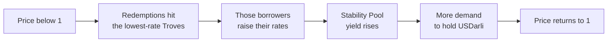

# Darli

*Borrow against ETH at a rate you choose. Whitepaper, public edition, version 0.0.1* · 2026-09-22 · USDarli

Darli is a proposed protocol for borrowing against ETH and issuing **USDarli**, a dollar stablecoin, on the Base network. Borrowers choose their own interest rate; loans that pay less interest are first in line when holders redeem USDarli for collateral. This mechanism ties the cost of borrowing to the demand for holding the stablecoin.

The first version is deliberately narrow: one collateral, one stablecoin, one network. It aims to offer borrowing at a self-chosen rate, exits that no oracle, pause or vote can block, and a market whose liquidity can be measured. The stability of USDarli's price depends on sufficient collateral, a healthy price oracle, liquidity in its market, and the maintenance transactions that someone has to send.

Darli is **immutable**. There is no governance, no admin key, no upgrade path, no pause and no parameter that anyone can change after deployment. The DARLI token has one job: its stakers receive the protocol's share of fee revenue, as revenue, with no vote. This paper explains the economic mechanism, who bears each loss, what immutability costs, and the evidence that exists today.

**Status.** Darli is a design. Nothing is deployed, nothing is audited, the DARLI token does not exist, and the launch figures in this paper are working assumptions. This paper is not an offer of any token or financial product, and nothing in it is legal or financial advice.

## 1. The problem and who Darli is for

Someone who holds ETH and needs dollars has two choices today: sell, or borrow at a rate set by a pool's utilisation curve or a committee. Someone who wants to hold a decentralised dollar must trust either a custodian or a mechanism they cannot inspect. Darli addresses both with one loop: borrowers price their own loans, and holders can always turn the stablecoin back into collateral.

**For a borrower, why Darli?** You choose your rate and can change it. Repaying, adding collateral and closing never depend on the oracle, on a pause, or on a vote. Transactions on Base cost cents. In exchange you accept two risks that Section 4 walks through: *redemption* (if your rate is among the lowest, part of your loan can be repaid for you against your collateral, at fair value) and *liquidation* (if your collateral falls too far).

**For a holder, why USDarli?** While the system is live, every token can be redeemed for a dollar's worth of ETH, minus a fee, whenever the protocol has a valid price. If the rules ever shut the system down, redemption is replaced by a staged settlement in which every holder is paid at the same rate, but only after every Trove has been processed (Section 4). Depositing it in the Stability Pool earns most of the interest that borrowers pay, plus discounted collateral from liquidations, and carries the risk of absorbing losses in a crash.

**What is USDarli for?** A stablecoin that is useful only inside its own protocol lives on the interest its borrowers pay, and that limits how far it can grow. Darli's answer comes in steps, and only the first step is part of version 1:

| Step | Use | What it needs |
| --- | --- | --- |
| 1 | **Payments.** A dollar on a network where a transfer costs cents, redeemable without a custodian | A tight price and enough market liquidity that a merchant can convert on receipt. At pilot size this is an aim, not a fact (Section 8) |
| 2 | **Savings and liquidity instruments.** A transferable token that represents a Stability Pool deposit, so that the yield-bearing position can itself be held, traded or used as collateral | A wrapper outside the core that handles the ETH a deposit receives in liquidations. Later work, with its own audit |
| 3 | **An ecosystem around the protocol.** Interfaces that earn a share of the interest they bring in; keepers; integrations in wallets and other protocols | Open interfaces, a reference keeper, and frontend incentives that are part of version 1 |

Until step 1 is real, demand for USDarli comes mostly from the yield that borrowers fund. The launch simulation shows the consequence: redemptions are frequent and low-rate borrowers are often repaid against their will. The paper does not assume demand that does not yet exist. Payment and investment uses can also carry regulatory obligations that depend on jurisdiction; they are outside this paper.

## 2. Borrowing

One example runs through the rest of this paper. All prices are illustrative.

> **Maya** holds 10 ETH, worth 30,000 dollars at 3,000 dollars each. She locks them in Darli, mints 12,000 USDarli, and sets her interest rate to 5% a year. Her collateral ratio is 250%.

Her position is a **Trove**, held as an NFT. Four numbers define it: collateral, debt, the annual rate she chose, and when she last changed that rate.

**The rate is her decision and her trade-off.** A higher rate costs more but moves her further back in the redemption queue (Section 3). A lower rate is cheaper but puts her near the front. She can change it at any time; changing it again within seven days costs a fee, so nobody can sit at the bottom rate and jump just before a redemption.

**What it costs.** Opening the loan costs an upfront fee of seven days' interest at the average rate of all borrowers: about 0.1% of the loan when the average is 5%. After that she pays only her own rate. Interest is added to her debt whenever her Trove is touched, so her true annual cost lies between the stated rate (if the Trove is never touched) and continuous compounding (if it is touched constantly, which anyone may do). At 5% that gap is at most about 0.13 percentage points; near the 250% maximum it is very large. Interfaces must show both figures. There is no repayment schedule and no maturity.

**The rules she must respect.**

| Rule | Value at launch | Meaning for Maya |
| --- | --- | --- |
| Minimum collateral ratio | 110% | Below it, anyone may liquidate her |
| Critical ratio of the whole system | 150% | If all borrowers together fall below it, nobody can add risk; she can still repay, add collateral and leave |
| Minimum debt | 500 USDarli (proposed) | Keeps the redemption queue free of dust loans |
| Interest rate | 0.5% to 250% | Her choice |

**What nobody can take from her.** While the system is live, repaying, adding collateral and closing her Trove never need a price, and nothing in the protocol can pause or block them. If the rules ever shut the system down, her exit takes another form, described in Section 4: her Trove is settled at par out of her own collateral, which she or anybody else can trigger at once, and what is left over is hers. These are the three actions that reduce risk, and the contracts never forbid them. That is a statement about the contracts: she still needs the USDarli to repay with, and a network that is processing transactions.

## 3. The peg

**The promise, stated carefully.** Whenever the protocol has a valid price, anyone can hand in USDarli and receive one dollar of ETH per token, minus a fee, taken from the Troves that pay the lowest interest. If USDarli trades below one dollar by more than that fee, buying it and redeeming it is profitable, and that buying pushes the price back up. This is an economic incentive, not a guaranteed floor. Its strength depends on the fee at that moment, on a healthy oracle, on sufficient collateral, and on someone actually sending the transaction. No person or vote can switch redemption off. It does stop by itself while there is no valid price, and after a shutdown it continues in a different form, at a frozen or current price (Section 4).

**The fee.** At least 0.5%. On top sits a component that jumps with each redemption, in proportion to the share of supply redeemed, and halves every six hours. It stops a run from emptying the system and makes very large redemptions expensive. The fee stays in the redeemed Trove as extra collateral, so the borrower who is redeemed is compensated.

Above one dollar the loop runs in reverse: nobody is redeemed, borrowers lower their rates, borrowing gets cheaper and supply expands.

> **Maya, situation 1: USDarli falls to 0.985.** Suppose the supply is 100,000, as in the pilot, and no redemption has happened for a while. A keeper buys 1,000 USDarli for 985 dollars and redeems it. The fee is the 0.5% floor plus 0.25% for redeeming 1% of the supply (with β = 4), so 0.75%. Maya's 5% is the lowest rate, so her Trove is first: her debt falls from 12,000 to 11,000, and ETH worth 1,000 dollars leaves her Trove, less the fee of 7.50 dollars that stays with her. She has lost nothing in dollar terms and gained the fee, but she now holds less ETH than she intended. If she wants that not to happen again she raises her rate. *Who pays: nobody loses. The keeper receives 992.50 dollars of ETH for 985 dollars, about 7.50 before gas and slippage.*
>
> Size matters. Redeeming 4,000 at once would cost 1.5% at this supply and would leave the keeper nothing at a price of 0.985, which is why redemption in a small system works in small steps and the price can sit a little under one dollar. At a supply of one million the same 4,000 would cost 0.6%.

**Two honest limits.**

*The first days.* A new system starts with a high redemption fee that halves every six hours. It protects a newborn supply from being redeemed away, and for the same reason gives early buyers little redemption support. Two cases must be kept apart:

| Starting fee component | After 12 hours | After 24 hours | After 48 hours |
| --- | --- | --- | --- |
| 100%: the default for an uncapped system | about 25.5% | about 6.75% | about 0.89% |
| 10%: **the pilot**, whose debt cap already limits a redemption run | about 3.0% | about 1.1% | about 0.54% |

Figures include the 0.5% floor and exclude the extra cost of the request itself. Either way the first day is weaker than normal operation, so the launch opens in stages (Section 8).

*Above one dollar there is no hard ceiling.* The only corrective trade is to open a Trove, mint and sell, then carry the debt until the price returns. It ties up ETH and carries its price risk. A module that swaps USDC for USDarli one-to-one would cap the price, but it would make USDarli's backing depend on a custodial asset, so Darli does not include one. For a payments use this limit matters less than the lower one, since a merchant is hurt by receiving less than a dollar, but it is real and unsolved.

## 4. Liquidation and who bears losses

When a Trove's collateral is worth less than 110% of its debt, anyone may liquidate it. The debt is not settled by selling ETH on a market, which is slow and fails exactly when markets crash. It is settled from the **Stability Pool**: USDarli deposited there is burned to cancel the debt, and the depositors receive the Trove's ETH at a discount of up to 5%. If the pool is empty, debt and collateral are passed to the remaining borrowers instead, with a premium of up to 10%. If there is no one left to receive them, the remainder is recorded as **bad debt** with its own bucket of collateral, the system shuts down, and holders can claim that bucket pro rata.

> **Maya, situation 2: ETH falls to 1,300 dollars.** Her 10 ETH are worth 13,000 against a debt of 12,000: a ratio of 108%. A keeper liquidates her. The keeper receives 0.5% of the collateral (65 dollars) plus a small gas deposit Maya posted at opening. The Stability Pool burns 12,000 USDarli and receives ETH worth 12,600. The remaining 335 dollars of ETH go back to Maya. *Who pays: Maya loses 665 dollars of the 1,000 she had left; depositors gain 600; holders are untouched.*
>
> **The same, but ETH gaps to 1,100 before anyone can act.** Her collateral is worth 11,000, less than her debt. The pool still burns 12,000 USDarli and receives everything left after the keeper's 55 dollars: ETH worth 10,945. *Who pays: depositors lose 1,055 dollars. The 5% is a cap, not a guarantee.* With an empty pool the same loss would fall on the other borrowers; with no other borrowers, on all holders of USDarli.
>
> **Situation 3: the price oracle fails.** If the feed is stale, malformed, or the Base sequencer is down, the protocol enters a *temporary* state: nobody can borrow, withdraw collateral, liquidate or redeem against that collateral, and Maya can still repay, add collateral or close. Only if the feed stays dead for a full day while the network is healthy does the system shut down for good, at the last good price. From then on the system is wound up by the staged settlement described below, at that frozen price. *Who pays: if ETH has risen since, borrowers who stay lose to redeemers (before a shutdown their defence is to repay and leave; after it, that route is closed and the frozen reference price binds them as well); if it has fallen, holders receive less than a dollar. The promise of "one dollar of collateral" holds only while a valid price exists.*
>
> **Situation 4: Maya leaves.** After six months she owes 12,000 plus about 300 of interest. She buys the missing USDarli, repays, and receives her 10 ETH and her gas deposit. No price, pause or vote is involved.

**The order in which losses land.**

| Shock | First | Then | Last |
| --- | --- | --- | --- |
| A Trove falls below 110% but is still worth more than its debt | The borrower (penalty) |  | Depositors gain |
| A Trove is worth less than its debt | The borrower (everything) | Stability Pool depositors | Other borrowers, then all holders |
| The oracle dies | Whoever is on the wrong side of the frozen price |  |  |

**How much stress the design takes.** The proposed pilot (Section 8) was simulated exactly as stated, with its finite budgets, 20 runs per case, and with settlement carried through after a shutdown so that what holders finally receive is measured rather than assumed. A sequencer outage is modelled as what it is: nobody can transact at all, followed by a grace period.

| ETH shock on day 90 | Runs that shut down | Lowest economic backing over the whole path, mean / median / worst | System-wide recovery per USDarli, mean / worst run | Worst single account (100 USDarli or more) | Share of holders' balances that lost 1% or more, mean / worst run | Stability Pool result, mean / worst | LP at settlement value, mean / worst |
| --- | --- | --- | --- | --- | --- | --- | --- |
| none (calm, one 10% sale) | 0 of 20 | 177% / 182% / 123% | 1.000 / 1.00 | 1.00 | 0% / 0% | +360 / +0 | +0.8% / +0.5% |
| −40% in a day, network up | 3 of 20 | 138% / 135% / 104% | 0.997 / 0.97 | 0.97 | 15% / 100% | +1,306 / +0 | +0.6% / -0.8% |
| −40%, price feed dead for 12 hours | 3 of 20 | 138% / 135% / 104% | 0.996 / 0.96 | 0.96 | 15% / 100% | +1,281 / +0 | +0.6% / -1.6% |
| −40% during a 12-hour sequencer outage | 3 of 20 | 139% / 134% / 104% | 0.996 / 0.96 | 0.96 | 15% / 100% | +1,218 / +0 | +0.6% / -1.6% |
| −60% in a day, network up | 13 of 20 | 112% / 109% / 103% | 1.000 / 0.95 | 0.95 | 40% / 100% | +2,079 / +175 | +0.2% / -2.6% |
| **−60% during a 24-hour sequencer outage** | 13 of 20 | 99% / 103% / 57% | 0.922 / 0.57 | 0.57 | 35% / 100% | -2,404 / -14,012 | -4.3% / -23.2% |

"Economic backing" is all collateral at the market price over all debt, measured every hour including during outages and after a shutdown; it is not the ratio the contracts can see. "Recovery" is measured **under this simulation's settlement assumptions**: contract balances are first paid out to their beneficiaries, then every Trove is settled and every holder claims, in random order (the order makes no difference, see below).

Read it this way. In these twenty runs per case, while keepers could act every hour, the system often shut down, which is the designed response, and holders recovered between 0.95 and 1.00 per USDarli; where they recovered less than one, the cause was the fall of the collateral's market price between the shutdown and the claim, not a shortfall. That is a result about these runs and this distribution of collateral ratios, not a property of the design. What breaks the design is a large gap **while nobody can transact**.

**Settlement after a shutdown: equal claims are paid equally.** The simplest way to wind a shut-down system up is to let each redeemer take collateral from any Trove, first come, first served. Under that rule, when some Troves are under water, two equal holders can receive 1.02 and 0.77, or 0.38 in a harsher case, depending only on who acted first. Darli replaces it with a staged settlement whose goal is that every holder can redeem the same relative quantity of collateral regardless of when they act; under-water Troves are processed before anyone is paid, which is what prevents the race.

1. **The shutdown fixes one reference price**: the valid price at that moment, or the last good price if the oracle has failed. Later market moves change nothing.
2. **Phase 1: every Trove is settled**, by anyone, one transaction per Trove, in any order. A Trove hands over collateral worth its debt at the reference price, or everything it has if it is under water. Repaying, closing, liquidating and redeeming against single Troves all stop at the shutdown, because each of them would let somebody leave at a better rate than the rest. Stability Pool deposits can be withdrawn at any time and then rank like any other USDarli; the pool absorbs nothing after a shutdown.
3. **Phase 2 starts only when no Trove is left unsettled.** Every USDarli then claims the same fraction of the common pot, in any order and at any later time.

Tested on two-Trove counter-examples and a three-Trove case, in **every** order of settling and **every** order of claiming: the payout per token is the same up to rounding, and equals an independent computation in exact arithmetic. The rounding is bounded, and the bound depends on how many claims came before: each claim is rounded down once and leaves less than one wei of dust in the pot, and a later claim can pick up at most one wei per earlier claim, so a payout moves by at most one wei for every claim made before it (external review measured 40 wei after 100 tiny earlier claims); splitting a claim into k parts loses at most k wei. Within that bound, and only within it, the result does not depend on the order. In the simulated pilot the spread between the best- and the worst-paid account is zero in every run.

**Who bears the shortfall of under-water Troves: decided.** When some Troves are under water at the reference price, the healthy borrowers' surplus collateral absorbs that shortfall first: every healthy borrower gives up the *same fraction* of his surplus, and holders take a haircut only once all surplus is used up. Surplus is therefore released only when phase 1 is complete. This keeps the ranking of losses the same before and after a shutdown (while the system is live, redistribution also puts a bad Trove's loss on the other borrowers before it reaches holders), though not the same amounts: live redistribution spreads a loss in proportion to collateral, settlement in proportion to surplus. The alternative, protecting each borrower's surplus and putting the whole shortfall on the holders' common rate, was modelled and rejected for a token meant for payments and savings; in the two-Trove example it would pay holders 0.80 instead of 0.90 and leave the healthy borrower 0.995 ETH instead of nothing. This is part of what Darli promises a borrower: **after a shutdown, your surplus is the first thing that covers other borrowers' shortfalls.** It is a constant of the deployment; nothing can select the other rule.

**Making sure settlement ends.** Equal pay-outs are worth nothing if nobody can be paid, and in this design nobody is paid until phase 1 is over. Four things make it end. Settling a Trove is constant work: the contract keeps a counter of open Troves and never scans them (tested with 1,500 Troves, with any scan made to fail the test). Troves are settled in bounded batches of at most 50. Whoever settles a Trove receives the gas deposit its borrower posted at opening, so the work is paid for whether or not the owner cares, which matters most for under-water Troves, whose owners have nothing to gain. And a Trove that nobody has processed does not hold everybody hostage indefinitely: thirty days after the shutdown a second path opens, and anyone may write it off, for half of its gas deposit. Its debt then counts as a claim like any other and its collateral counts as zero for the time being, so phase 1 can end and holders are paid at a conservative rate. If the Trove is settled later after all, the totals are recomputed and only the difference is moved, so that the end state is *exactly* what a timely settlement would have produced, for holders and for borrowers alike: a holder who claimed before the recovery and one who claimed after it, and a borrower whose surplus had covered for it, all end where they would have ended anyway. Four ways this mechanism can go wrong each carry a permanent test: recoveries shared at a stale fraction (worth 12.5 ETH moved from one borrower to another in the pinned case), a claim against an empty pot carrying no right to later recoveries, a borrower with several Troves losing part of his surplus depending on *when* he claimed, and a Trove paying out more reward than the gas deposit it had posted. A combinatorial test runs 32 specified parameter combinations (one or several owners, with and without deposits, recovery before or after phase 1 ends, claims before, between and after recoveries, empty or non-empty pot) against an independent exact-arithmetic computation. That is evidence over those combinations, on one set of collateral and debt values; it is not a proof over all paths, and equality of the final accounting says nothing about the economic cost of waiting for it. The accounting now keeps amounts actually paid rather than fractions, and every named pool is checked to be non-negative on every step. Two limits remain. The thirty days are not a ceiling on the wait: after them the write-off still has to be *done*, one transaction per remaining Trove, and both paths share the same reading of the Trove's debt and of the reference price, so a failure inside those shared parts would stop both; the model does not cover that case. And if a written-off Trove truly can never be settled, its own collateral is stuck for ever.

**What staged settlement costs.** Until phase 1 ends, which takes one transaction per Trove and, for Troves nobody processes, at least thirty days, no holder can turn USDarli into collateral. A borrower can no longer escape a stale reference price by repaying: after an oracle-failure shutdown the last good price binds borrowers as well as holders. And holders carry the market risk of the collateral from the shutdown until they claim: in the simulation the worst recovery in the 40% cases was 0.97 for that reason alone, with no shortfall at all.

Valued at a nominal one dollar per USDarli, the liquidity provider in the worst run shows a profit; at settlement value it lost 23%. The upper-side keeper treasury of 40,000 dollars, modelled as a real ledger of ETH and cash, was short for about 20 hours per run even in calm markets and for 25 to 70 hours per run in the crash cases; its own result ranged from about −60 to about +1,100 dollars. All figures in this table are under staged settlement with healthy borrowers absorbing first; in the worst case every holder shared the loss at the same rate and the spread between accounts was zero. These are outcomes of an uncalibrated simulation of one pool and one collateral. They show where losses land and roughly how large they are, not what will happen.

## 5. Market and revenue

Three money flows exist around Darli. They have different sources and different recipients, and they should never be added together.

| Flow | Source | Recipients |
| --- | --- | --- |
| Interest and loan fees | Growth of borrowers' debt | Stability Pool depositors 72%; DARLI stakers 25%; frontends 3%. Nothing is directed by a vote and nothing goes to a treasury |
| Trading fees | Traders in the USDarli pool on Uniswap | The owners of that liquidity |
| Liquidation gain or loss | A liquidated Trove's collateral against the debt absorbed | Stability Pool depositors, or the borrowers who receive a redistribution |

Two cautions. Interest that is *booked* is not yet interest that is *paid*: it is added to a borrower's debt and only becomes real when that debt is repaid, redeemed or liquidated with enough collateral. And a liquidity provider's fee income is not the same as profit: it sits against the risk of holding the asset everyone is selling.

**Liquidity.** Version 1 uses an ordinary Uniswap pool and no hook. Liquidity is meant to sit in a vault that holds one position in a fixed, narrow range around one dollar against a quote asset such as USDC. **The protocol pays no liquidity incentives**: the whole protocol share of revenue goes to stakers, so liquidity providers earn swap fees only, plus whatever DARLI distribution programme is decided outside the protocol . At pilot size this means the team provides the liquidity. Nobody manages it and the range never moves; a different range means a new vault, which liquidity providers join by their own choice. The cost of concentration is capacity: a position absorbs only about half its capital in one-directional flow, and at the edge of its range it holds a single asset and earns nothing until the price returns. A seller the pool cannot serve still has redemption, at the price of its fee. Swap fees, split by token, and any reward tokens paid into the vault are accounted separately; joining gives no claim on earlier fees, and leaving forfeits nothing already earned. There are no management or performance fees.

**Keepers.** Smart contracts do nothing by themselves. Liquidations, redemption arbitrage, the mint-and-sell trade above one dollar, oracle checks and reward distribution are all open calls that someone must send, and any wallet may. These trades execute atomically with a minimum-profit check, which removes the risk of a half-finished trade but not the risks of fees, competition, failed transactions, oracle delay or a thin exit market. In the simulation, slow keepers tripled the average distance from the peg. An open-source reference keeper is therefore part of the launch, and automation, including AI tooling for monitoring and for executing fixed rules, is what makes it affordable on a cheap network.

**Frontends.** Anyone can run an interface. A loan opened through it is tagged, and 3% of the interest that loan accrues is credited to the interface, which may pass part of it back to the borrower. There are no points, epochs or competitions to game; a borrower who registers their own interface simply receives a 3% discount on interest. This is how the ecosystem of step 3 in Section 1 is meant to fund itself from the first day.

## 6. No governance, and what DARLI does

**Nobody can change Darli.** Every parameter in this paper is a constant fixed at deployment: the price feed, the collateral ratios, the penalties, the fee parameters, the split of interest, the minimum debt, the debt-cap schedule. There are no proxies, no owner, no multisig, no timelock, no pause. What was deployed is what runs, for as long as the chain runs.

| Question | Answer |
| --- | --- |
| Who can change a parameter? | Nobody |
| Who can add a collateral or a currency to this system? | Nobody. A new collateral or a new currency is a **new, independent deployment** with its own token, vaults and feed. It shares no state with this one and cannot touch its collateral |
| Who can pause borrowing, redemption or withdrawals? | Nobody |
| Who can shut the system down? | Only the rules: the system ratio falling below the shutdown ratio, a credible oracle failure, or recorded bad debt |
| What if a bug is found? | It cannot be patched. Users leave, which is always possible, and a corrected version is deployed separately. This is the price of immutability, and it is why the audits, the reference model and a low opening cap matter more here than in an upgradable protocol |
| What if the oracle provider retires the feed? | The system eventually shuts down by its own rules and settles; a new deployment uses a new feed |

**What this removes.** Earlier drafts gave a token-governed body the power to add collateral branches and tune parameters. That power could be captured: a majority could have added a worthless collateral and redeemed against honest users' ETH, and the drafts admitted that no bound on that loss could be proven. Immutability removes that risk entirely, together with the Guardian, the timelocks and every rule that existed only to contain governance. The trust a user places in Darli is now trust in the code, the oracle provider, the collateral and the network, and in nobody's future decisions.

**The debt cap without a governor.** A cap that nobody can raise has to raise itself. The cap follows a schedule written into the contract: it opens at about 125,000, doubles by itself at most once every 30 days, and stops at a ceiling chosen at deployment. No vote is involved. The cap limits only new borrowing; interest, repayment and collateral top-ups are never blocked by it.

**The constants.** Because nothing can be changed later, every value below is final at deployment.

| Constant | Value | Reason |
| --- | --- | --- |
| Minimum / critical / shutdown ratio (ETH) | 110% / 150% / 110% | Standard for a volatile collateral with a fast liquidation path |
| Liquidation premium: Stability Pool / redistribution | 5% / 10% | Caps, not guarantees |
| Interest rate range; upfront fee; rate-change cooldown | 0.5% to 250%; 7 days of average interest; 7 days | Bounds the rate market and makes rate-flipping costly |
| Redemption fee floor; decay half-life | 0.5%; 6 hours | Keeps a small arbitrage margin |
| Liquidator's share of collateral | 0.5% capped at 2 ETH | Pays for gas without inviting liquidation hunting |
| Winding up after a shutdown | staged settlement: one reference price, every Trove settled, then one common rate; no bonus | Equal claims are paid equally, whatever the order |
| Token stakers' share of revenue | 25% of interest and loan fees, pro rata to stake, paid second by second during the week after it is handed over | A token with revenue and no power |
| Interest to the Stability Pool / to interfaces / to liquidity | 72% / 3% / 0% | The Stability Pool is the first line of defence; interfaces funded from day one; liquidity provision is a studied, undecided proposal |
| Redemption fee sensitivity β | **undecided** (4 in the pilot simulations) | Two studies disagree. With a pool whose price is free to move, 4 tightens the peg at every size tested (100,000 to 5 million). With the fixed-range pool this design actually uses, 1 gives far fewer redemptions and borrower exits, because the band itself carries the price. β trades the holder's cost of exit against the borrower's redemption burden |
| Initial redemption fee component | 10% | The opening debt cap already limits a redemption run |
| Minimum debt | 500 (proposed) | Cheap gas on Base; finer loans improve the peg at small size |
| Debt cap | built-in schedule | A guarded opening without a governor |

β, the initial fee component and the minimum debt are the values most in need of further evidence before they are frozen for ever; β in particular cannot be fixed on present evidence.

**The DARLI token: revenue, no power.** DARLI has a fixed supply, created once, and **no vote of any kind**: it cannot direct funds, choose destinations or influence the protocol.

- Whoever stakes DARLI receives the protocol's share of fee revenue, 25% of all interest and loan fees, pro rata to stake.
- Revenue reaches stakers through a permissionless, stateless hand-over: anyone may call it, and it moves whatever has accumulated to the staking contract. Payouts run in fixed weekly epochs: whatever is handed over during one week is paid out second by second during the next week, at a rate fixed when that week begins. Staking just before a payment therefore earns only the seconds actually staked, and a later hand-over can never touch the schedule of an earlier one: what is handed over during one week becomes claimable, second by second, during the next week, provided somebody is staked during that week; a later hand-over never postpones an earlier one. If nobody is staked, the amount waits for the next week in which somebody is; becoming claimable is not the same as being withdrawn, which is up to each staker; and rounding leaves dust of less than a millionth of a token. (Fixed epochs are the whole point: a stream that re-spreads its unpaid remainder over a fresh seven days at every hand-over, the usual design, would let one wei handed over every hour postpone payouts indefinitely. A permanent test pins that this one cannot.) Time during which nobody is staked is not lost; it joins the next epoch. The destination of the hand-over is fixed at deployment: the caller cannot choose where revenue goes.
- Staking and unstaking depend on no external call and cannot be blocked; what a staker has earned stays claimable after leaving.
- When the Stability Pool is almost empty its share cannot be credited to depositors, and goes to stakers as well.

There is nothing left to capture: a majority of DARLI has no more rights than any other staker. What remains is a plain economic fact and a regulatory one. A token whose only function is to pay its holders a share of revenue is closer to an investment instrument than a governance token is, and its treatment differs by jurisdiction; that is for counsel, not for this paper. And because the stakers' 25% is not spent on liquidity, USDarli's market liquidity must be earned by swap fees or funded from outside the protocol, which the launch simulation found to be the single most important factor for the peg at small size.

## 7. Comparison with similar protocols

Darli belongs to the family of over-collateralised stablecoins. The table compares it with the four protocols closest to it, as understood from their public documentation. Those protocols change, and this table describes them as known at the time of writing; it is not a substitute for their own documents.

| | **Darli** | **Liquity v2 (BOLD)** | **Liquity v1 (LUSD)** | **Maker / Sky (DAI, USDS)** | **Curve (crvUSD)** |
| --- | --- | --- | --- | --- | --- |
| Collateral (v1 scope) | ETH only, in the protocol's own vault | ETH and liquid-staking tokens, separate branches | ETH only | Many, including real-world assets and other stablecoins, governance-listed | Several crypto assets, governance-listed |
| Interest rate | Set by each borrower; lowest rates redeemed first | Set by each borrower; lowest rates redeemed first | None; one-time borrowing fee | Set by governance per collateral | Set by a formula from the stablecoin's market price and reserves |
| Price source | One external feed per branch, fixed at deployment; sequencer, staleness and gas guards; never the protocol's own pool | External feeds with fallbacks | External feed with a fallback | Governance-run oracle set | External feeds; the AMM's own price for soft liquidation |
| Liquidation | Stability Pool, then redistribution, then an explicit bad-debt ledger; never a market sale | Stability Pool, then redistribution | Stability Pool, then redistribution | Collateral auctions | Continuous "soft" liquidation inside a purpose-built AMM, then hard liquidation |
| Peg below one | Redemption at par against the lowest-rate Troves; fee floor plus a decaying component | Same design | Same design | Peg-stability module against other stablecoins; governance-set rates | Peg keepers that mint or burn into stablecoin pools |
| Governance | **None.** Every value is a deployment constant; no owner, proxy or pause | Immutable core; token holders direct a share of interest to liquidity incentives | Immutable | Token-holder governance sets nearly everything | DAO governance |
| Token | No vote; stakers receive 25% of interest and loan fees, streamed in fixed weekly epochs | Vote on where incentive revenue goes; no revenue to holders | Stakers receive borrowing and redemption fees; no vote | Governance token, also a backstop of last resort | Governance token with fee sharing |
| After shutdown | One reference price; every Trove settled; then one common rate for every token, in any order; a written-off Trove cannot block completion and later recoveries reach every claim alike | Redemption against any Trove, first come first served, with a bonus | Redemption against any Trove | Emergency shutdown with a common rate for holders after a processing period; borrowers' surplus protected | Governance-driven wind-down |
| Loss sharing at settlement | Healthy borrowers' surplus absorbs shortfalls first, equal fraction each | Whoever redeems first is paid best | Whoever redeems first is paid best | Holders bear shortfalls; borrowers keep surplus | Governance decides |
| Adding collateral or a currency | A new, independent deployment; nothing shared with the existing one | New branches within one system | Not possible | Governance vote | Governance vote |
| Liquidity incentives from revenue | None (a 10% share is a studied, undecided proposal) | 25% of interest, directed by token vote | Token emissions to early providers | Governance budget | Governance budget |

**What Darli shares with this family.** Over-collateralised, borrower-chosen rates and rate-ordered redemption as the peg mechanism, and a Stability Pool as the first line of defence are the same ideas as in the Liquity line; the goal of a race-free settlement after shutdown is the same as in Maker's emergency shutdown.

**Where Darli differs.**
- *No governance at all*, including over the debt cap, the token and the addition of collateral; the price of that choice (no patch, no emergency lever) is stated in Section 6.
- *A revenue token with no vote*, so that a majority of the token cannot influence where protocol money goes.
- *Settlement after shutdown pays equal claims equally* and is guaranteed to complete: constant work per Trove, paid settlers, batches, and a write-off path whose later recoveries are shared by every claim. The first-come rule of the Liquity line, and the residual race Maker's processing period leaves if an under-water position is missed, are both avoided; the cost is that no holder is paid until every Trove is processed.
- *Loss sharing at settlement puts healthy borrowers' surplus before holders*, the opposite of Maker's vault parity, chosen because the token is meant for payments and savings.
- *Always-open exits while live* (repay, add collateral, close, leave the Stability Pool) need no price and cannot be blocked; after a shutdown they are replaced by par settlement out of the borrower's own collateral.
- *An explicit bad-debt ledger* instead of an implicit shortfall.
- *A built-in debt cap* that raises itself on a schedule, for a guarded opening without a governor.
- *The protocol's own pool is never a price source, never holds collateral, and is created at par inside the deployment*; the core has no dependency on it.
- *Oracle failure has a temporary state before it becomes permanent*, with a fixed gas stipend for the feed read.

**What Darli does not have that others do.** No soft liquidation (crvUSD), no multi-collateral system in version 1 (all four others), no peg-stability module or backstop token (Maker), no protocol-funded liquidity (Liquity v2, Maker, Curve), and no operating history at all.

## 8. Evidence and launch plan

**What stands behind this paper.** The rules were developed against an executable reference model rather than prose alone: an exact-arithmetic model of the accounting, the oracle logic and the distribution of revenue and the one-shot deployment; 30 scenarios, one for every failure mode found so far; two randomised testers that check, before and after each step, the invariants each of them implements (the coverage file lists which invariants are checked where, and which are not checked at all); 32 known bugs deliberately put back to confirm the tests catch them (every one is caught by a scenario; the random testers alone catch 10 of the 32, the other 22 being pinned only by scenarios); an agent-based launch simulation; and a small set of Solidity tests that reproduce the mathematics bit for bit on a real EVM. Every error found so far in the accounting rules, in the simulator or in this paper's own claims is now a permanent test or a corrected statement. The evidence package is public with this paper, and every figure here can be regenerated from it. A reader who has only this paper should treat the figures as unverified.

| Claim | Support today |
| --- | --- |
| Token supply always equals total recorded debt; nothing is ownerless, including rounding dust and bad-debt collateral | Tested continuously in the model |
| Newcomers cannot capture rewards earned before they arrived | Tested |
| The built-in debt-cap schedule cannot be outrun; stakers' revenue is streamed, so staking just before a payment earns only its seconds; everything routed is paid out | Tested |
| A sequencer outage never causes a permanent shutdown; a caller's choice of gas cannot fake an oracle failure | Tested; the gas result was reproduced on an EVM with synthetic feeds, not yet against a live feed |
| The interest-rate loop holds the peg | Simulation with uncalibrated behaviour; comparable interest-rate loops run in production in other protocols (Section 7) |
| The launch parameters are right | Only partly examined |
| No party can change the protocol after deployment | A property of the design, to be verified in the code and the audits: no owner, no proxy, no setter. Not yet built |
| License | MIT (Copyright (c) 2026 USDarli); the legal review named in the specification is **not done** |

**The pilot.** Base, because its ETH market is deep enough that redeemed collateral sells with negligible slippage, and its gas is cheap enough for automated keepers acting on one-dollar margins; both proved decisive in simulation. About 100,000 dollars of debt is the smallest size at which the mechanism works in simulation (about 50,000 with a 500-dollar minimum debt), and results stop improving at about 250,000. Self-sufficiency is far higher: at pilot size keepers earn a few hundred dollars a year and liquidity providers receive no protocol incentives at all, so the team must run the keepers and provide the liquidity itself.

All figures below are working assumptions until the gates are passed.

| Item | Assumption |
| --- | --- |
| Team Trove | about 90,000 dollars of ETH, minting about 35,000 USDarli. USDarli placed in the pool or the Stability Pool comes from here and is not counted again as outside capital |
| Pool | about 15,000 USDarli plus 15,000 dollars of quote asset, in a fixed narrow range. It can absorb about 15,000 dollars of one-way flow |
| Stability Pool seed | about 20,000 USDarli, so the first liquidations have somewhere to go |
| Upper-side keeper reserve | 20,000 to 40,000 dollars of ETH |
| Users' borrowing | A cap of about 125,000 at opening, which has to hold the team's 35,000 as well as users' loans; it doubles by itself, at most every 30 days, up to a ceiling fixed at deployment. No vote, no key; minimum loan 500 |
| Running costs | keepers, monitoring, infrastructure, interface. The protocol keeps no revenue, so these are funded from outside it; budget and runway to be published |

**Staged opening.** Seed the Stability Pool and the pool; open borrowing under the first cap; let the launch fee decay (the pilot starts it at 10% rather than 100%, because the cap already limits what a redemption run could take); after that the cap rises by its built-in schedule, with nobody's permission. The simulation of Section 4 ran exactly this configuration, including the finite keeper reserve and borrowers with limited spare collateral; the cap doubled by itself on day 30, as written in the contract. The upper-side keeper reserve of 40,000 dollars fell short in every scenario, for about 20 hours per run in calm markets and 25 to 70 in the crash cases: after a crash, supply shrinks, the price presses against the top of the range, and the treasury cannot lock enough ETH to bring it back. The reserve in the balance sheet is therefore a lower bound, not a tested sufficiency.

**Deployment: one transaction, then no powers.** Everything that happens once happens together: the USDarli token is created, its set of minters (the branch contracts) is written and sealed for ever, the revenue destination is fixed, and the canonical USDarli / USDC pool in Uniswap v4 is initialised at a price of one, with no hook, together with the fixed-range liquidity vault bound to it. The deployer is the only part of Darli that touches Uniswap; the core contracts never learn the pool's address, never read its price and never depend on its existence.

Creating the pool inside the deployment does **not** make it impossible to front-run. A contract's future address can be computed from its creator's address and nonce, and Uniswap v4 lets anyone initialise any pool key, without checking that the tokens exist. An attacker can therefore initialise the canonical pool first, at any price. The design therefore does not depend on winning that race: a failed initialisation is tolerated only if the pool demonstrably exists afterwards (any other failure stops the deployment, so that it can never report success without a pool), and the record shows the price the pool really has next to the price that was asked for; the liquidity vault refuses deposits while the pool's price is outside its fixed range, which only guarantees that liquidity does not enter outside the band: a price pushed to 1.009 is inside it, so this is not protection against manipulation. That protection is the depositor's own price bounds, stated with every deposit as with any swap, together with correcting the price and seeding liquidity in one transaction; and the price of a pool without liquidity can be moved by anybody at no cost. The demonstrated effect of the attack was denial of service, not loss of funds. Both remaining assumptions (free price correction in an empty pool, and the vault guard) still have to be confirmed against the real PoolManager on a fork. No pool is created for DARLI.

**What "immutable" still has to prove.** Removing governance from the design is not the same as showing that the deployed contracts leave no door open. Before deployment it must be shown, in code and in the audits, that: after set-up no new minter of USDarli can ever be added (the token's minter set is written once and sealed; the sample token contract in the evidence package now does this and tests it); set-up cannot be run twice; the revenue destination and the staking contract cannot be replaced, and the caller of the hand-over cannot choose the destination; and no path remains by which another collateral could be attached to this supply of USDarli.

**Liquidity without protocol incentives has not been evaluated.** The simulation never paid liquidity incentives, so its figures did not move when the 25% went to stakers; that is a gap in the simulation, not evidence that the change is harmless. What the simulation does show is the fee-only return of the liquidity position: about +0.8% over six calm months, far too little to attract outside capital. A later study let liquidity enter and leave with its return: giving liquidity providers 10% of interest (taken from the stakers' 25%) raised the capital that stays in the pool from about 13,000 to about 21,000 dollars. That result shows how sensitive liquidity is to an assumed income, nothing more: the share was not actually distributed in the model, the stakers' loss was not modelled, the providers' collateral was unlimited, and the pool was not the fixed-range vault. The split 72 / 10 / 15 / 3 remains a proposal. Still unmodelled: stakers selling their revenue, the team withdrawing capital, and the budget and runway for keepers and infrastructure.

**Gates.** Core contracts in an open repository with every model scenario replayed against them; a fork test of the oracle against the live Base feed; a test of what happens when the price leaves the vault's range; a keeper-outage drill; the signed opening balance sheet and DARLI distribution; two independent audits.

**After the pilot.** In order: payments integrations and merchant conversion paths once the price is tight and liquidity is deep; a transferable Stability Pool token as a savings and collateral instrument; managed rate strategies; staked-ETH collateral; a second currency; Uniswap v4 hooks only if data shows that plain redemption is too slow. Every one of these is a separate deployment or a contract outside the core; none changes the system described here.

**Companion documents.** *Full specification* (the normative text for implementers); *Evidence package* (models, scenarios, random testers, mutation harness, simulations, Solidity cross-checks, recorded results with file hashes).
